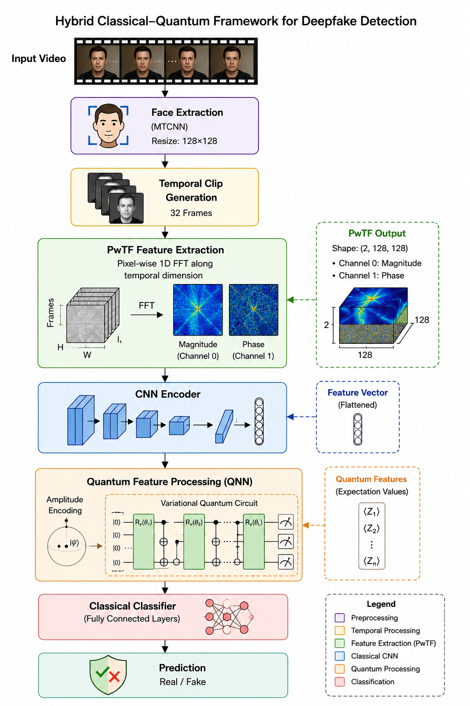

# Hybrid CNN-QNN Framework using Pixel-wise Temporal Frequency Analysis for Deepfake Detection
## Overview
<p> This project proposes a hybrid classical–quantum deepfake detection framework that leverages Pixel-wise Temporal Frequency (PwTF) analysis to capture subtle temporal inconsistencies in manipulated videos. 
The extracted PwTF representations of the input video are processed using a CNN-based feature encoder and further mapped into a quantum feature space using a variational quantum neural network for binary deepfake classification.</p>

## Dataset

Trained on a subset of the following two datasets:-

FaceForensics++ : https://www.kaggle.com/datasets/xdxd003/ff-c23

celebdf: https://www.kaggle.com/datasets/reubensuju/celeb-df-v2

## Architecture

<p align="center">

</p>

## Setup
<ul>
<li>Install the requirements in the predefined order to avoid version conflicts.</li>

<li>If you're using google colab, mount the drive using the following code- 


```python
from google.colab import drive
drive.mount('/content/drive', force_remount=True)
```
</li>
</ul>

## Pipeline
<ol background-color="#8F7D77">
<li>
 Preprocess-
   <ol type="a">
    <li>MTCNN_face_extraction.py</li>
   
   <li>feature_extaction.py</li>
   
   <li>build_dataset.py</li>
   
   <li>extract_labels.py</li>
   
   <li>train_val_split.py</li>
   
   <li>classify_dataset.py</li>
   
   <li>dataloader.py</li>
   </ol>
   </li>
   <li>
Models-
   <ol >
   <li>CNN_encoder.py</li>
   
   <li>quantum_layer.py</li>
   
   <li>hybrid_model.py</li>
   </ol>
   </li>
   <li>
Training-
   <ol type="a">
   <li>setup.py</li>
   
   <li>training_function.py</li>
   
   <li>validation_funtion.py</li>
   
   <li>train_val.py</li>
   </ol>
   </li>
   <li>
Inference-
    <ol type="a">
  <li>predict_pwtf_clip.py</li>
   
   <li>predict_vid.py</li>
   
   <li>predict_vid_folder.py                 -- if you want to predict multiple videos at once</li> 
   </ol>
   </li>
</ol>

## Results
